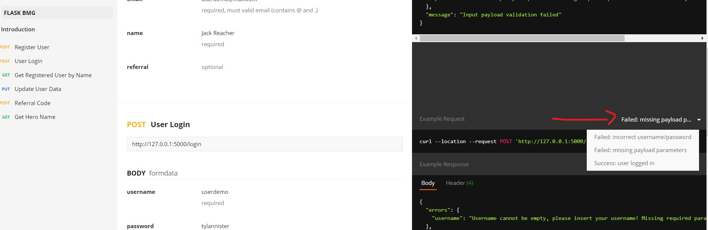

## Project Tools Detail
This project is build using the specific tools versioning:
- Python 3.8.10
- Postgres 13.3-2
- Ubuntu 20.04 on Windows 10 WSL
- Redis 5.0.7
- Notes: 
    When running in Ubuntu, if there's an error regarding psycopg2/wheel install. 
    Please do the following:
    1. Install wheel -> `pip3 install wheel`
    2. Install development headers for postgresql -> `sudo apt install python3-dev libpq-dev`

## Setup Before Running Application:
1. Please configure the `config.py` file in the __flask_app__ directory to setup database and redis connection.
2. Create the database in your postgresql with the same name as __DB_NAME__ in `config.py`.
3. Create your virtual env `python3 -m venv venv`
4. Activate your virtual env:
    - Windows: `venv/bin/activate`
    - Linux: `source venv/bin/activate`
5. Install the required library from __requirements.txt__ -> `pip3 install -r requirements.txt`
6. Run the application by executing `run.py` -> `python3 run.py`

## API Documentation: 
1. For list of all API Endpoint, please click [link](https://documenter.getpostman.com/view/9351386/U16kqk2W#intro)
2. For these specific routes, please add Authorization Bearer Token to access the routes, Bearer Token can be obtained from /login.
    - /user
    - /referral
    - /hero
    
3. Make sure to check every Example Request in each route for detailed response.  
    
